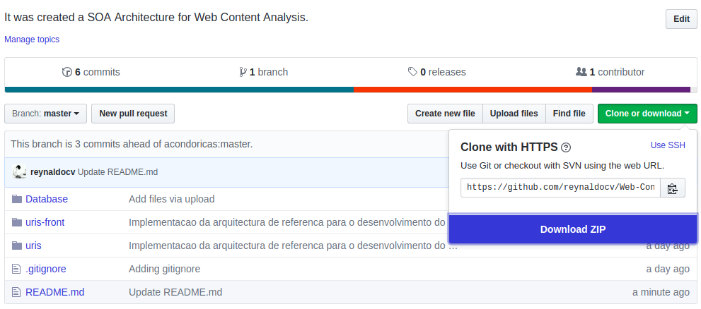
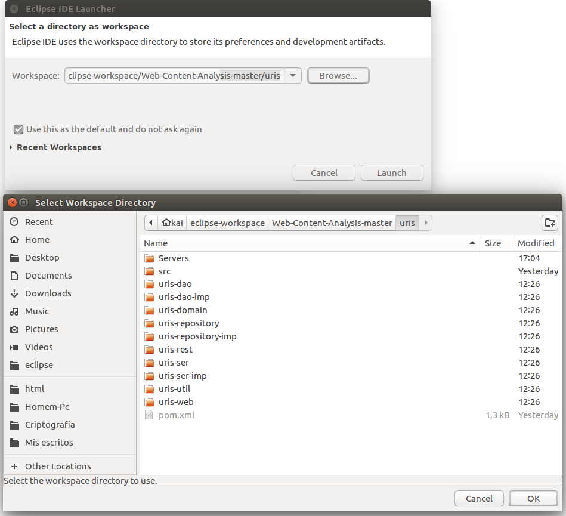
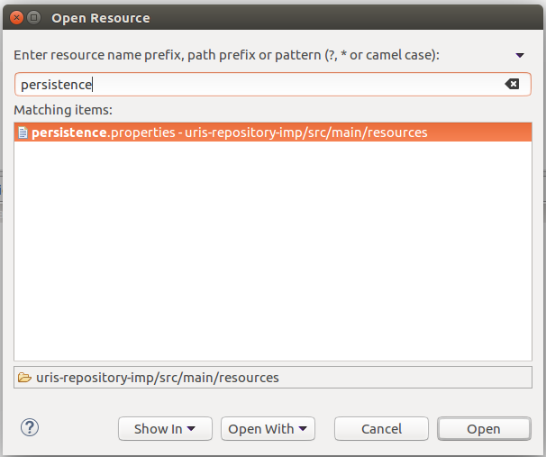
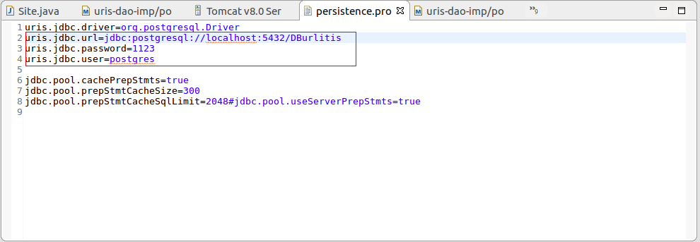

# Web-Content-Analysis
It was created a SOA Architecture  for   Web Content Analysis. 

## Instalação do Banco de Dados 

## Instalação do Ambiente (ECLIPSE)

Descargamos o respositorio e extraimos en algum endereço.

      
   

Abrimos o IDE Eclipse e selecionamos como workspace o endereçõ de nossa carpeta $uri$ do repositorio.

      
   

Já estando no ambiente, presionamos Crtl+Shift+R e digitamos Persistence, e clickamos no arquivo.

      
   

A seguir, temos un arquivo onde fazemos a configuração para ter conetividade com o Banco de Dados do Postgresql.

      
   

